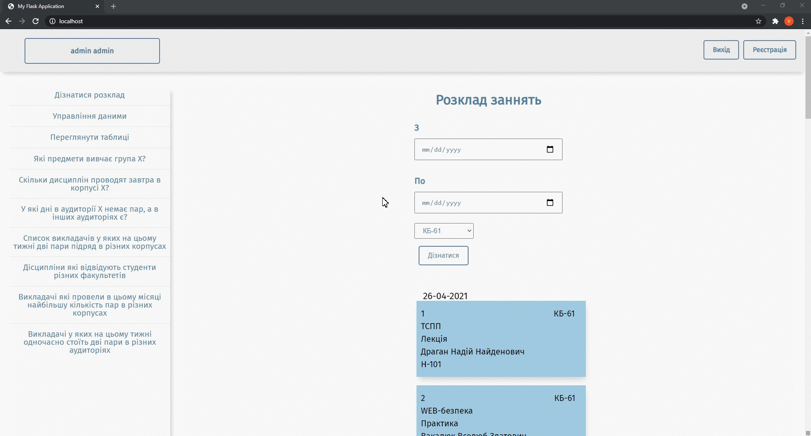
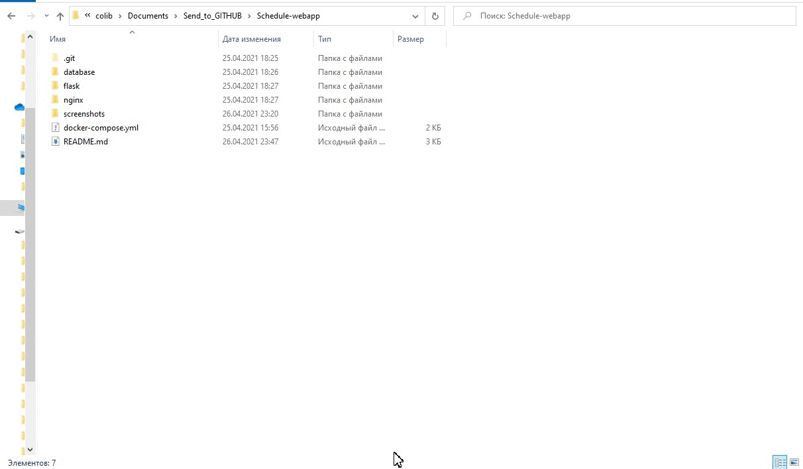

# Lessons Scheduling Web App
The Schedule Web Application is an information system for creating and showing a timetable for students and teachers.
## Table of Contents
- [About](#about)
- [Features](#features)
- [App screenshots](#app-screenshots)
- [Run app with Docker](#run-app-with-docker)
- [Containers default parameters](#containers-default-parameters)

## About
This application was developed as the final project of the university database course. The main goal of the project is to apply the acquired knowledge for developing an information system. 
The Schedule Web application makes it possible to manage information about teachers, students, departments, groups, lessons, subjects, audiences, buildings and create schedules for students and teachers. 

## Features
With The Schedule Web App you can:
- Sing-up and log in.
- Add audience, professor name, and other information for each lesson.
- Make a schedule.
- Be aware of the free audience, topics that study groups, and other useful information, which will simplify scheduling.
- Keep data up to date.
- Check the schedule.

## App screenshots
The main page where you can view the timetable.

Tables that provide information about subjects, students, lessons, etc.

It's the data management page.

Additional information for planning simplification.

## Run app with Docker
1. [Download](https://www.docker.com/products/docker-desktop) and install Docker to deploy the web application.
    - [See how to install on Windows](https://docs.docker.com/docker-for-windows/install). 
    - [See how to install on Linux.](https://docs.docker.com/engine/install/ubuntu/)
2. Before web application deployment change default configuration in **docker-compose.yml** and **db_script.sql** files. Skip this step if you just want to test a system.
3. Open the command line in the project folder and enter ``docker-compose up --build``

## Containers default parameters
**Database**
- **port** : 5433
- **username** : postgres;
- **password** : example
- **database** : scheduleapp

**Nginx**
- **port** : 80

**Web App login**
- **login** : admin
- **password** : 12345

**pgadmin**
- **port** : 81
- **email** : example@domain.com
- **password** : example
